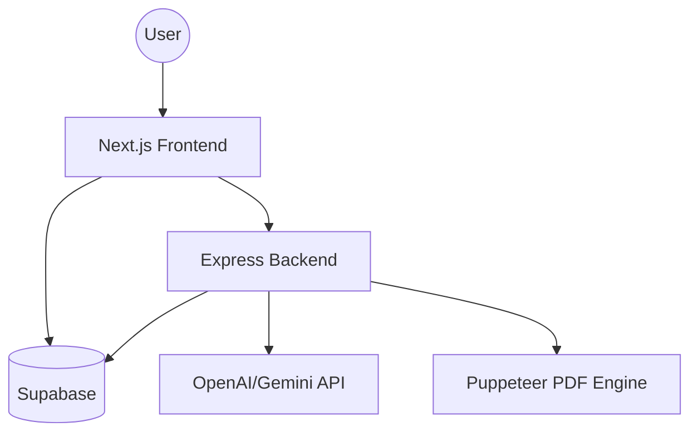

# System Architecture

Resumy is built as a distributed system with a clear separation between the presentation layer and the core processing engine. 

## 🏗️ High-Level Overview

## 1. Frontend (Next.js 14)
The frontend is a modern React application utilizing the Next.js App Router for optimized performance and routing.

- **Rendering**: Static Site Generation (SSG) for public pages, Client-side Rendering (CSR) for the interactive editor.
- **State Management**: React Hooks (useState, useEffect) and Context API for authentication and editor state.
- **Styling**: Tailwind CSS for high-fidelity, responsive UI components.
- **Animations**: Framer Motion for premium loading states and interactive transitions.

## 2. Backend (Express.js)
The backend acts as an orchestration layer for heavy processing and external API integrations.

- **AI Services**: Orchestrates resume parsing, content generation, and suggestion logic.
- **PDF Generation**: Manages a headless Chromium engine to transform HTML templates into pixel-perfect PDF documents.
- **OCR/Processing**: Handles OCR for image-based resumes using Tesseract.js.
- **Security**: Implements virus scanning and rate limiting to protect the system.

## 3. Database & Auth (Supabase)
Supabase is used as the primary data persistence and authentication provider.

- **PostgreSQL**: Stores user profiles, resume drafts, AI job statuses, and customization settings.
- **Auth**: Handles standard email/password authentication and session management.
- **Storage**: S3-compatible storage for resume file uploads and exports.
- **RLS (Row Level Security)**: Ensures that users only have access to their own data.

## 4. Shared Layer
The `/shared` folder contains shared TypeScript types and constants used by both the frontend and backend to ensure end-to-end type safety.
